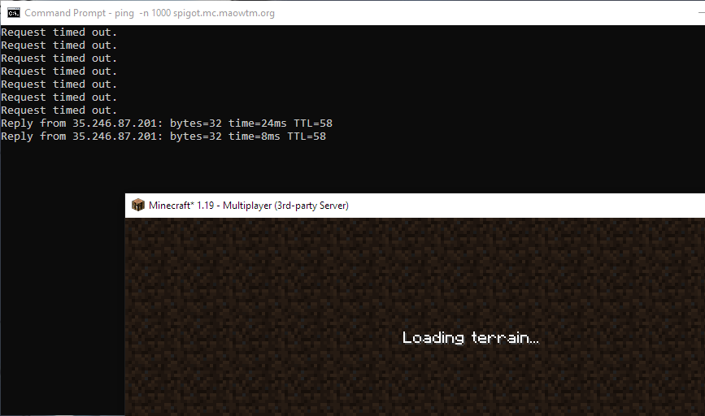

Cloud Platforms hate this! You won't believe how much money you can save via this one weird trick &mdash; turning things off when you don't use them!

# Minecraft Auto Suspend

This plugin uses the ["suspend"](https://cloud.google.com/compute/docs/instances/suspend-resume-instance) functionality in Google Cloud to suspend your server VM when no players are in the server, and resumes it whenever someone tries to connect.

A suspended VM only incur storage costs, much like a stopped VM, but enables very quick resuming of the Minecraft server. In my personal setup, joining a suspended (sleeping) server takes around 10 seconds, during which the player just sees "Joining world".

**Only Google Cloud Compute Engine VMs are supported currently, and only a single backing server**.

## Setup

To use this plugin, you need two VMs - one is your "real" (backing) server and can be whatever configuration you like, the other is a small, cheap VM (I use e2-micro) that runs BungeeCord with this plugin.

[BungeeCord](https://www.spigotmc.org/wiki/about-bungeecord/) is a lightweight Minecraft server proxy with plugin support that is commonly used by multi-server networks to enable seamless switching. However, this is not what we will be using it for. Instead, we will simply use it as a frontend to our server that can detect connection attempts and resume/suspend our backing server automatically.

You can download BungeeCord.jar from the [official Jenkins](https://ci.md-5.net/job/BungeeCord/). Follow the [setup instructions](https://www.spigotmc.org/wiki/bungeecord-installation/#general-installation-advice) for BungeeCord (most importantly, your backend server must be running in offline mode and also not be accessible from the public Internet, allowing only connections from the BungeeCord VM). Place [this plugin's jar file](https://github.com/micromaomao/minecraft-autosuspend/releases/) into the plugins folder and the [config file](bungeecord/plugins/autosuspend/config.yml) into `plugins/autosuspend/config.yml`. Change the settings under `gce` to be your backing server VM's project, region and instance name.

You can optionally change `sleep_delay_secs` to be a value you find suitable. This controls how long to wait before suspending when the last player leaves. If anyone joins again before this time is reached the server will keep running as normal. Note that suspending also takes time, and can't be aborted.

The BungeeCord VM needs to be attached to a service account with permission to modify the backing server VM. See later sections on how to do this.

Allocate a static internal IP for the backing server VM, and put it in `servers.default.address` of the BungeeCord's [`config.yml`](bungeecord/config.yml). Create firewall rules that allow connections between the two VMs. A tutorial on how to do this can be found below.

If the above setup has been finished successfully, your backing server should now be suspended automatically. If you need to stop the plugin from suspending it (for example to do maintenance work), you can use the `keepalive` command followed by the number of minutes to keep it up, or `/keepalive indefinitely` if you promise that you will not forget to run `/keepalive 0` to reset it.

### Note: Setting up the service account

For those unfamiliar with operating service accounts on Google Cloud, here is a short tutorial on how to set up the permissions required for this plugin.

TODO

### Note: Setting an static internal IP and firewall rules for the server VM

TODO

## Commands

* `/keepalive <number of minutes>` or `/keepalive indefinitely`: Force the server to keep running, even when no players are online. Can be useful for maintenance work, upgrades, etc. Requires permission `auto_suspend.keepalive`
